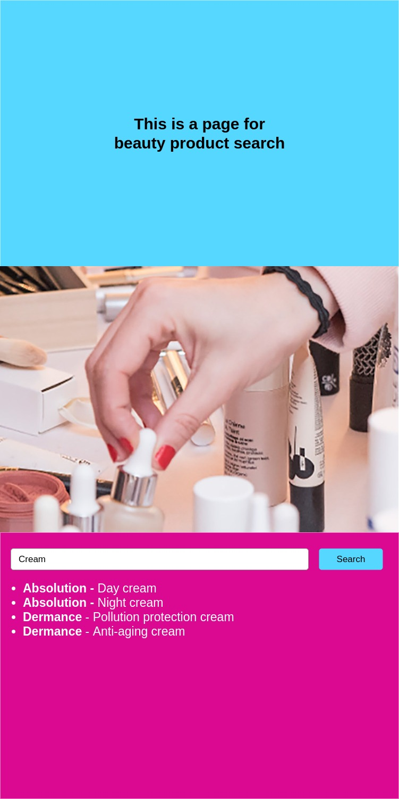

# Front-End Developer Interview Challenge

This goal of this task is to assess your technical skills as a developer, your capacity to work with specifications and your ability to use best practices.

Don't hesitate to ask questions if necessary. You can also make assumptions when necessary as long as you detail them.

Use any online resources you see fit.

## Evaluation

You will be evaluated both on the final result, the choices you made on how to achieve it and the respect of the best practices.

## Context

A beauty shop wants to provide customers with an easy way of finding specific products.

## Proposed Solution

A web application that allows customers to search for a product using a search form.

The given starting code is in Vue.js but you can use React if you are more comfortable with it.

## Your task

Implement a simple proof-of-concept front-end application based on the design sketches provided by the designer.

### Resources

Images and design sketches are located in the resources folder.
Colours are #55D7FF and #DB0992.

### API

The API that will be used is the community based test API [Skin Care API](https://github.com/LauraRobertson/skincareAPI).

The pagination feature of this API is not working. If you encounter any other problem with it, don't hesitate to contact us.

Because of CORS issues, please use the following URL to do a search on the API: 
```https://thawing-scrubland-03171.herokuapp.com/https://skincare-api.herokuapp.com```

#### Desktop


#### Mobile




## Available Scripts

In the project directory, you can run:

### `npm start`

Runs the app in the development mode.\
Open [http://localhost:3000](http://localhost:3000) to view it in the browser.

The page will reload if you make edits.\
You will also see any lint errors in the console.

### `npm test`

Launches the test runner in the interactive watch mode.\
See the section about [running tests](https://facebook.github.io/create-react-app/docs/running-tests) for more information.

### `npm run build`

Builds the app for production to the `build` folder.\
It correctly bundles React in production mode and optimizes the build for the best performance.

The build is minified and the filenames include the hashes.\
Your app is ready to be deployed!

See the section about [deployment](https://facebook.github.io/create-react-app/docs/deployment) for more information.

### `npm run eject`

**Note: this is a one-way operation. Once you `eject`, you can’t go back!**

If you aren’t satisfied with the build tool and configuration choices, you can `eject` at any time. This command will remove the single build dependency from your project.

Instead, it will copy all the configuration files and the transitive dependencies (webpack, Babel, ESLint, etc) right into your project so you have full control over them. All of the commands except `eject` will still work, but they will point to the copied scripts so you can tweak them. At this point you’re on your own.

You don’t have to ever use `eject`. The curated feature set is suitable for small and middle deployments, and you shouldn’t feel obligated to use this feature. However we understand that this tool wouldn’t be useful if you couldn’t customize it when you are ready for it.

